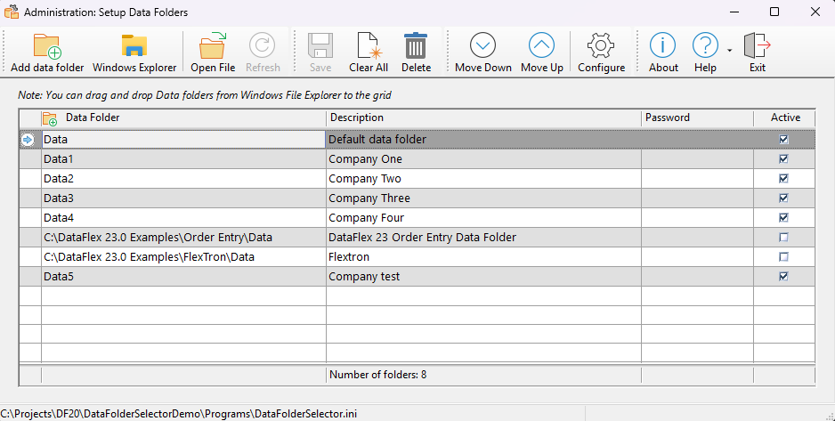

# Data Folder Selector Utility

The **Data Folder Selector Utility** helps users select a Data folder (Client Company) to use when a program starts.

## Components

This utility consists of two main components:

1. **SetupDataFolder.exe**: An administrator program where Data folders are added, which can later be selected by end-users.
2. **DataFolderSelector.dg**: A dialog file that should be added to your program's Client_Area. It will automatically pop up when the program starts, allowing the user to select which Data folder/Company to use.

## Usage

The DataFlex Order Entry sample application's `Order.src` program has been modified to showcase how to use the DataFolderSelector library logic in an application.

To use the Data Folder Selector Utility in your application:

1. Add the `DataFolderSelector.dg` file to your program's `Client_Area`.
2. Compile the `SetupDataFolders.src` program once.

That's all it takes to integrate the logic!

## Example

Below is a sample image of what the `SetupDataFolders.src` program looks like:

