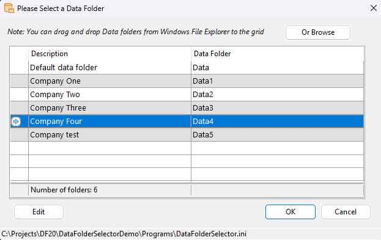

# Data Folder Selector Demo

The **Data Folder Selector Utility** allows users to select a Data folder (Client Company) when starting a program.

## Components

This utility includes two main components:

1. **SetupDataFolder.exe**: An administrator program used to add Data folders, which can later be selected by end-users.
2. **DataFolderSelector.dg**: A dialog file that should be integrated into your program's Client Area. It automatically appears when the program starts, enabling the user to choose which Data folder/Company to use.

## Usage

The DataFlex Order Entry sample application's `Order.src` program has been modified to demonstrate how to incorporate the DataFolderSelector library logic into an application.

To use the Data Folder Selector Utility in your application:

1. Add the `DataFolderSelector.dg` file to your program's Client Area.
2. Compile the `SetupDataFolders.src` program once.

That's all it takes to integrate the logic!

## Example

Below is a sample image showcasing how it looks when the `Order.src` program is started:

